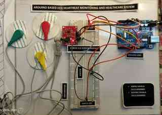

# ECG Heartbeat Monitoring System

A microcontroller-based ECG signal monitoring prototype developed using an **Arduino UNO** and **AD8232 ECG sensor module**. The system acquires an ECG signal, monitors electrode lead-off status, transmits sampled data over serial communication, and provides basic local LED/buzzer indication.

> **Note:** This project is an educational embedded-systems prototype and is **not a medical diagnostic device**.

## 1. Project Overview

Electrocardiography (ECG) is a method of recording the electrical activity of the heart. This project demonstrates the basic process of acquiring an ECG signal using the AD8232 sensor, interfacing the sensor with an Arduino UNO, and observing the acquired signal through serial visualization.

The project was developed as an individual hands-on implementation to strengthen practical understanding of **sensor interfacing, analog signal acquisition, lead-off detection, serial communication, and embedded-system prototyping**.

## 2. Prototype Implementation

The following photograph shows the implemented hardware prototype, including the Arduino UNO, AD8232 ECG sensor module, ECG electrodes, breadboard connections, LED indicators, and buzzer.



*Figure 1 — Arduino-based ECG heartbeat monitoring prototype.*

## 3. Circuit Design and Pin Mapping

The circuit was organized around the Arduino UNO and AD8232 ECG sensor module. The diagram below presents a cleaned engineering-style representation of the wiring used for the prototype, including the ECG signal path, lead-off inputs, LED indicators, and buzzer.


*Figure 2 — Cleaned circuit diagram based on the implemented prototype wiring.*

### Arduino UNO to AD8232 Connections

| Arduino UNO | AD8232 | Function |
|---|---|---|
| 3.3V | 3.3V | Sensor supply |
| GND | GND | Common ground |
| A0 | OUTPUT | Analog ECG signal |
| D10 | LO+ | Lead-off detection |
| D11 | LO− | Lead-off detection |

### Local Indication Connections

| Arduino UNO | Component | Function |
|---|---|---|
| D6 | Green LED through series resistor | Normal electrode connection indication |
| D7 | Red LED through series resistor | Lead-off indication |
| D8 | Buzzer | Audible lead-off indication |

The ECG electrodes are connected to the AD8232 electrode input terminals. The Arduino UNO reads the conditioned ECG signal through **A0** while **D10** and **D11** monitor the AD8232 lead-off outputs.

## 4. Objectives

- Interface an AD8232 ECG sensor with an Arduino UNO.
- Acquire the analog ECG signal through the microcontroller's ADC.
- Monitor the AD8232 lead-off outputs.
- Transmit sampled signal data through serial communication.
- Visualize the ECG waveform in real time.
- Implement LED and buzzer indication for electrode lead-off conditions.
- Verify the circuit design before and during hardware implementation.

## 5. System Architecture

```text
ECG Electrodes
      ↓
AD8232 ECG Sensor Module
      ↓
Analog ECG Signal ─────────→ Arduino UNO A0
      ↓                         │
Lead-Off Status ─────────────→ D10 / D11
                                │
                                ├──→ Serial Data → Computer / Serial Plotter
                                │
                                └──→ D6 / D7 / D8
                                      ↓
                                LED + Buzzer Indication
```

## 6. Hardware Components

| Component | Purpose |
|---|---|
| Arduino UNO | Microcontroller and analog signal acquisition |
| AD8232 ECG Sensor Module | ECG signal conditioning and lead-off detection |
| ECG Electrodes | Electrical signal acquisition from the subject |
| Green LED | Normal electrode connection indication |
| Red LED | Lead-off indication |
| Buzzer | Audible lead-off indication |
| Series Resistors | LED current limiting |
| Breadboard | Prototype circuit assembly |
| Jumper Wires | Electrical connections |

## 7. Software & Development Tools

- **Arduino IDE** — firmware development and programming
- **Arduino Serial Monitor / Serial Plotter** — serial data observation and ECG waveform visualization
- **Circuit-design / simulation software** — circuit planning and wiring verification

## 8. Working Principle

1. ECG electrodes acquire the electrical signal and feed it to the AD8232 module.
2. The **AD8232** conditions the low-level ECG signal and provides an analog output.
3. The Arduino UNO samples the analog output through **A0**.
4. The Arduino monitors **LO+** and **LO−** through digital pins **D10** and **D11** to detect a lead-off condition.
5. When the electrodes are connected correctly, the programmed green LED indication is enabled and the ECG samples are sent through the serial interface.
6. When a lead-off condition is detected, the red LED and buzzer are activated.
7. The serial data can be observed on a computer for waveform monitoring.

## 9. Implementation

### Signal Acquisition

The AD8232 analog output is connected to **A0** of the Arduino UNO. The microcontroller periodically reads the signal using its built-in ADC and sends the sampled value through the serial interface.

### Lead-Off Detection

The AD8232 provides **LO+** and **LO−** outputs for detecting electrode disconnection. These signals are connected to **D10** and **D11** respectively. If either lead-off input becomes active, the firmware switches the visual and audible indication to the lead-off state.

### Local Indication

- **D6:** Green LED for the normal electrode-connection state.
- **D7:** Red LED for the lead-off state.
- **D8:** Buzzer for the lead-off alert.

The firmware does not perform clinical ECG interpretation or medical abnormality classification.

## 10. Firmware

The Arduino firmware is available in:

`Arduino/ECG_Heartbeat_Monitor.ino`

The program initializes the analog input, lead-off inputs, LED outputs, buzzer output, and serial interface. ECG samples are printed to the serial interface when the electrode connection is considered valid; otherwise, the lead-off indication is activated.

## 11. Testing & Validation

The project was developed through circuit planning, simulation/design verification, and physical hardware prototyping.

The main validation points were:

- Correct Arduino UNO to AD8232 wiring
- Correct 3.3V sensor supply and common ground
- Analog ECG signal acquisition through A0
- Lead-off detection through D10 and D11
- Correct green/red LED operation
- Correct buzzer operation during lead-off
- Stable serial data transmission for waveform observation

## 12. Key Learning Outcomes

- Analog sensor interfacing with a microcontroller
- ADC-based signal acquisition
- Lead-off detection using a biomedical sensor module
- Serial communication using Arduino
- Basic ECG signal monitoring concepts
- Embedded firmware development
- Circuit design and hardware validation
- Practical embedded-system debugging

## 13. Project Status

**Status:** Completed Prototype

The project demonstrates an educational ECG signal acquisition and monitoring workflow using an Arduino UNO and AD8232 sensor module. The implementation is intended for learning and experimentation in embedded systems and sensor interfacing.

## 14. Limitations

- The system is intended for educational experimentation rather than clinical use.
- The LED and buzzer indication only represents the programmed lead-off condition and should not be interpreted as medical analysis.
- ECG signal quality can be affected by electrode placement, motion, electrical noise, and other environmental factors.
- Advanced filtering, reliable heart-rate extraction, and clinically validated abnormality detection are outside the current scope.

## 15. Future Improvements

- Implement digital filtering and baseline-wander removal.
- Develop a more robust heart-rate estimation algorithm.
- Add an OLED/LCD for standalone display.
- Add data logging for offline ECG analysis.
- Improve signal-quality assessment and noise handling.
- Develop more reliable signal-event detection and validation.

## 16. Repository Purpose

This repository documents the implementation of an **Arduino-based ECG monitoring prototype** and the practical engineering concepts explored during its development.

## Author

**Aman Shukla**  
B.Tech Electronics Engineering | Sensors & Transducers Technology  
Rajkiya Engineering College, Basti
