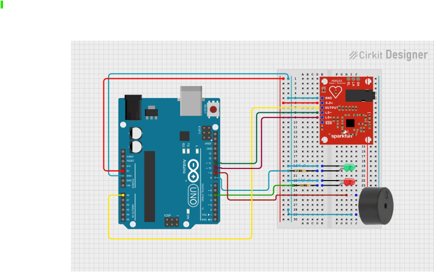
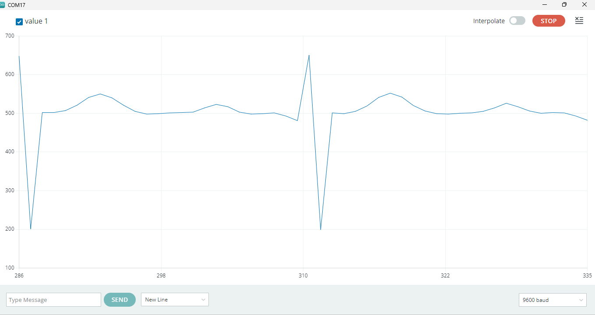

# ECG Heartbeat Monitoring System

A microcontroller-based ECG signal monitoring prototype developed using an **Arduino UNO** and **AD8232 ECG sensor module**. The system acquires an ECG signal, monitors electrode lead-off status, transmits sampled data over serial communication, and provides basic local LED/buzzer indication.

> **Note:** This is an educational embedded-systems prototype and is **not a medical diagnostic device**.

## Project Overview

This project demonstrates ECG signal acquisition using an AD8232 sensor module, Arduino UNO interfacing, lead-off detection, serial data transmission, and basic local indication.

## Circuit Diagram



## Hardware Prototype


## ECG Waveform



## Circuit Design and Pin Mapping

### Arduino UNO to AD8232

| Arduino UNO | AD8232 | Function |
|---|---|---|
| 3.3V | 3.3V | Sensor supply |
| GND | GND | Common ground |
| A0 | OUTPUT | Analog ECG signal |
| D10 | LO+ | Lead-off detection |
| D11 | LO− | Lead-off detection |

### Local Indication

| Arduino UNO | Component | Function |
|---|---|---|
| D6 | Green LED through series resistor | Normal electrode connection indication |
| D7 | Red LED through series resistor | Lead-off indication |
| D8 | Buzzer | Audible lead-off indication |

## Objectives

- Interface an AD8232 ECG sensor with an Arduino UNO.
- Acquire the analog ECG signal through the Arduino ADC.
- Monitor the AD8232 lead-off outputs.
- Transmit sampled signal data through serial communication.
- Observe the ECG waveform using the Arduino Serial Plotter.
- Provide LED and buzzer indication for electrode lead-off conditions.

## System Architecture

```text
ECG Electrodes
      ↓
AD8232 ECG Sensor Module
      ↓
Analog ECG Signal → Arduino UNO A0
Lead-Off Status   → D10 / D11
      ↓
Serial Data → Computer / Serial Plotter
      ↓
D6 / D7 / D8 → LED + Buzzer Indication
```

## Firmware

Firmware source: `Arduino/ECG_Heartbeat_Monitor.ino`

Current firmware uses A0 for ECG input, D10/D11 for lead-off detection, D6/D7 for LED indication, D8 for the buzzer, and 9600 baud serial communication.

## Project Status

**Status: Completed Prototype**

The project is an educational ECG signal acquisition and monitoring prototype for embedded-systems learning.

## Limitations

- Not for clinical diagnosis.
- Signal quality depends on electrode placement, motion, noise, and other conditions.
- Advanced filtering, robust heart-rate extraction, and clinically validated abnormality detection are outside the current scope.

## Repository Structure

```text
ECG-Heartbeat-Monitoring-System/
├── Arduino/
│   └── ECG_Heartbeat_Monitor.ino
├── images/
│   ├── ECG_Waveform.png
│   ├── ecg-circuit-diagram.png
│   └── ecg-hardware-setup.jpeg
├── LICENSE
└── README.md
```

## Author

**Aman Shukla**  
B.Tech Electronics Engineering | Sensors & Transducers Technology  
Rajkiya Engineering College, Basti
