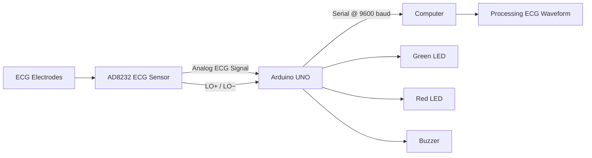

# ECG Heartbeat Monitoring System

A microcontroller-based ECG signal monitoring prototype built using an **Arduino UNO** and **AD8232 ECG sensor module**. The system acquires ECG signals, detects electrode lead-off conditions, sends sampled data over serial communication, and visualizes the waveform on a computer using **Processing**.

> **Note:** This is an educational embedded-systems prototype and is **not a medical diagnostic device**.

## Project Overview

The prototype demonstrates an ECG signal acquisition and visualization workflow:

**ECG Electrodes → AD8232 → Arduino UNO → Serial Communication → Processing**

The Arduino reads the analog ECG signal from the AD8232, monitors the **LO+ / LO−** lead-off outputs, and provides local LED and buzzer indication. Valid ECG samples are transmitted at **9600 baud** for computer-side visualization.

## Features

- ECG signal acquisition using the **AD8232**
- Analog ECG sampling through the **Arduino UNO ADC**
- Electrode lead-off detection using **LO+ / LO−**
- Serial transmission at **9600 baud**
- Real-time ECG waveform visualization using **Processing**
- Green LED indication when electrodes are connected
- Red LED and buzzer indication during lead-off detection
- Arduino Serial Plotter-compatible ECG sample output

## Hardware

| Component | Purpose |
|---|---|
| **Arduino UNO R3** | Microcontroller and ECG signal acquisition |
| **AD8232 ECG Sensor Module** | ECG signal conditioning and analog output |
| **ECG Electrodes** | ECG signal acquisition |
| **Green LED** | Normal electrode connection indication |
| **Red LED** | Lead-off indication |
| **Buzzer** | Audible lead-off indication |
| **Jumper Wires** | Circuit interconnections |
| **USB Cable** | Programming and serial communication |

## Circuit Diagram


The AD8232 provides the conditioned ECG signal to the Arduino UNO and exposes lead-off detection signals through **LO+** and **LO−**.

## Hardware Setup


The prototype uses an Arduino UNO, AD8232 ECG module, ECG electrodes, LEDs, buzzer, and supporting connections.

## ECG Waveform


The Arduino transmits valid ECG ADC samples over serial. The Processing sketch reads these samples and renders the waveform on the computer.

## Project Image


## Pin Configuration

### Arduino UNO ↔ AD8232

| Arduino UNO | AD8232 | Function |
|---|---|---|
| **3.3V** | 3.3V | Sensor supply |
| **GND** | GND | Common ground |
| **A0** | OUTPUT | Analog ECG signal |
| **D10** | LO+ | Lead-off detection |
| **D11** | LO− | Lead-off detection |

### Local Indication

| Arduino UNO | Component | Function |
|---|---|---|
| **D6** | Green LED | Electrodes connected |
| **D7** | Red LED | Lead-off indication |
| **D8** | Buzzer | Lead-off indication |

## Software and Tools

- **Arduino IDE** — Firmware development and upload
- **C/C++** — Arduino firmware
- **Processing** — Computer-side ECG waveform visualization
- **Java / Processing Java Mode** — Processing sketch
- **Serial Communication** — Transfers ECG samples from Arduino to the computer

## Firmware

Arduino firmware:

`Arduino/ECG_Heartbeat_Monitor.ino`

The firmware:

1. Reads the ECG signal from **A0** using `analogRead()`.
2. Checks **D10 / D11** for electrode lead-off.
3. Turns the green LED on when the lead-off inputs are inactive.
4. Turns the red LED and buzzer on when a lead-off condition is detected.
5. Sends ECG ADC samples over serial at **9600 baud** when the electrodes are connected.
6. Sends the text `Lead off` when a lead-off condition is detected.

The loop includes a **5 ms delay**, giving an approximate maximum sampling interval of 200 samples/second before accounting for serial transmission and execution overhead.

## Processing Visualization

Processing source:

`Processing/ECG_Waveform_Processing.pde`

The Processing sketch:

- Opens the Arduino serial connection at **9600 baud**.
- Uses **COM17** as the configured serial port.
- Maintains a waveform buffer.
- Accepts Arduino ADC values from **0–1023**.
- Draws the ECG waveform with a reference grid.
- Displays the serial port and baud-rate information.

> **Important:** Change `COM17` in the Processing sketch if the Arduino appears on a different serial port on your computer.

## System Architecture



## Objectives

- Interface an **AD8232 ECG sensor** with an Arduino UNO.
- Acquire ECG signals through the Arduino ADC.
- Detect electrode lead-off conditions.
- Transmit ECG samples through serial communication.
- Visualize the acquired waveform on a computer.
- Provide basic local status indication.

## Project Status

**Status: Completed Prototype**

**Academic Context:** B.Tech 2nd Year — 3rd Semester Minor Project

The project was developed as an academic embedded-systems prototype covering sensor interfacing, analog signal acquisition, digital status monitoring, serial communication, and computer-based waveform visualization.

## Limitations

- This prototype is **not intended for medical diagnosis or clinical use**.
- Signal quality depends on electrode placement, movement, electrical noise, and other environmental conditions.
- The current firmware does **not implement clinically validated heart-rate or arrhythmia detection**.
- The Processing visualization is intended for signal observation rather than medical interpretation.
- The Processing sketch currently uses a fixed serial port configuration (**COM17**).

## Repository Structure

```text
ECG-Heartbeat-Monitoring-System/
├── Arduino/
│   └── ECG_Heartbeat_Monitor.ino
├── Processing/
│   └── ECG_Waveform_Processing.pde
├── images/
│   ├── ECG_Waveform.png
│   ├── IMG-20250219-WA0012.jpg
│   ├── README
│   ├── ecg-circuit-diagram.png
│   └── ecg-hardware-setup.jpeg
├── ecg-circuit-diagram.png
├── LICENSE
└── README.md
```

## Author

**Aman Shukla**  
B.Tech Electronics Engineering | Sensors & Transducers Technology  
Rajkiya Engineering College, Basti
