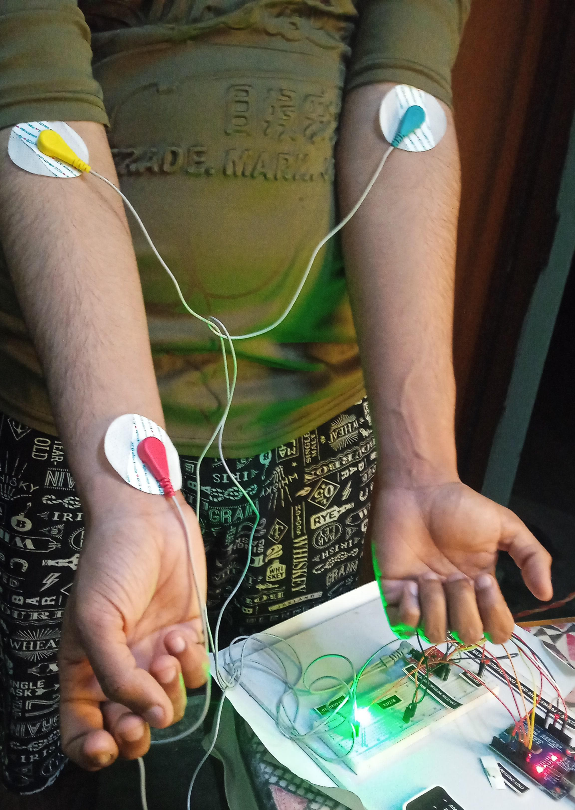
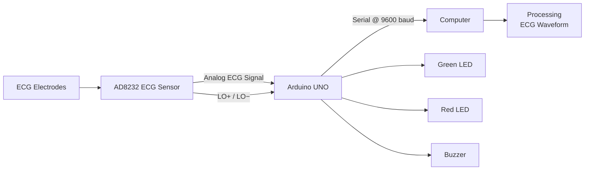

# ECG Heartbeat Monitoring System

A microcontroller-based ECG signal monitoring prototype built using an **Arduino UNO** and **AD8232 ECG sensor module**. The system acquires ECG signals, monitors electrode lead-off status, sends sampled data over serial communication, and visualizes the waveform on a computer using **Processing**.

> **Note:** This is an educational embedded-systems prototype and is **not a medical diagnostic device**.

## Project Overview

The project demonstrates a complete ECG signal acquisition workflow:

**ECG Electrodes → AD8232 → Arduino UNO → Serial Communication → Processing**

In addition to waveform acquisition, the prototype includes local **LED and buzzer indication** for electrode lead-off conditions.

## Features

- ECG signal acquisition using the **AD8232**
- Analog signal sampling through the **Arduino UNO ADC**
- Electrode lead-off detection using **LO+ / LO−**
- Serial transmission of ECG samples at **9600 baud**
- Real-time ECG waveform visualization using **Processing**
- Green LED indication for normal electrode connection
- Red LED and buzzer indication for lead-off condition

## Hardware

| Component | Purpose |
|---|---|
| **Arduino UNO R3** | Main microcontroller and ECG signal acquisition |
| **AD8232 ECG Sensor Module** | ECG signal conditioning and analog output |
| **ECG Electrodes** | Capture ECG electrical signals |
| **Green LED** | Normal electrode connection indication |
| **Red LED** | Lead-off indication |
| **Buzzer** | Audible lead-off indication |
| **Jumper Wires** | Circuit interconnections |
| **USB Cable** | Programming and serial communication |

## Circuit Diagram


The circuit connects the AD8232 ECG sensor to the Arduino UNO for analog ECG acquisition and lead-off detection.

## Hardware Setup


The hardware prototype consists of the Arduino UNO, AD8232 ECG sensor module, ECG electrodes, LEDs, buzzer, and supporting wiring.

## ECG Waveform


The acquired ECG signal is transmitted from the Arduino to the computer and visualized using the Processing sketch.

## Additional Project Image



## Pin Configuration

### Arduino UNO ↔ AD8232

| Arduino UNO | AD8232 | Function |
|---|---|---|
| **3.3V** | 3.3V | Sensor supply |
| **GND** | GND | Common ground |
| **A0** | OUTPUT | Analog ECG signal |
| **D10** | LO+ | Lead-off detection |
| **D11** | LO− | Lead-off detection |

### Local Indication

| Arduino UNO | Component | Function |
|---|---|---|
| **D6** | Green LED | Normal electrode connection |
| **D7** | Red LED | Lead-off indication |
| **D8** | Buzzer | Audible lead-off indication |

## Software and Tools

- **Arduino IDE** — Firmware development and upload
- **C/C++** — Arduino firmware
- **Processing** — ECG waveform visualization
- **Java / Processing Java Mode** — Computer-side visualization
- **Serial Communication** — Transfers ECG samples from Arduino to the computer

## Firmware

Arduino firmware:

`Arduino/ECG_Heartbeat_Monitor.ino`

The firmware uses:

- **A0** — ECG analog input
- **D10 / D11** — AD8232 lead-off detection
- **D6 / D7** — LED indication
- **D8** — Buzzer
- **9600 baud** — Serial communication

## Processing Visualization

Processing source:

`Processing/ECG_Waveform_Processing.pde`

The Processing sketch receives the serial ECG samples from the Arduino and displays the waveform on the computer.

## System Architecture



## Objectives

- Interface an AD8232 ECG sensor with an Arduino UNO.
- Acquire ECG signals through the Arduino ADC.
- Detect electrode lead-off conditions.
- Transmit ECG samples through serial communication.
- Visualize the ECG waveform on a computer.
- Provide basic local status indication.

## Project Status

**Status: Completed Prototype**

The project was developed as an educational embedded-systems project to demonstrate ECG signal acquisition, sensor interfacing, serial communication, and computer-based waveform visualization.

## Limitations

- This prototype is **not intended for medical diagnosis or clinical use**.
- ECG signal quality depends on electrode placement, movement, electrical noise, and other environmental factors.
- The project focuses on signal acquisition and visualization rather than clinically validated heart-rate or arrhythmia diagnosis.

## Repository Structure

```text
ECG-Heartbeat-Monitoring-System/
├── Arduino/
│   └── ECG_Heartbeat_Monitor.ino
├── Processing/
│   └── ECG_Waveform_Processing.pde
├── images/
│   ├── ECG_Waveform.png
│   ├── IMG-20250219-WA0012.jpg
│   ├── README
│   ├── ecg-circuit-diagram.png
│   └── ecg-hardware-setup.jpeg
├── LICENSE
└── README.md
```

## Author

**Aman Shukla**  
B.Tech Electronics Engineering | Sensors & Transducers Technology  
Rajkiya Engineering College, Basti
